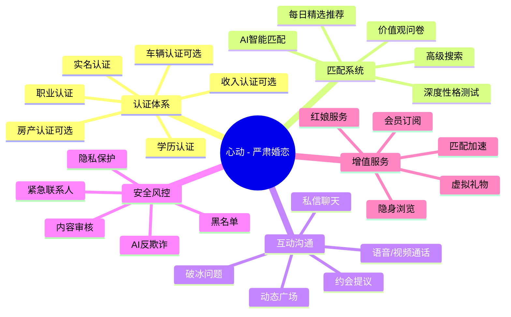
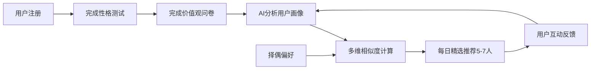
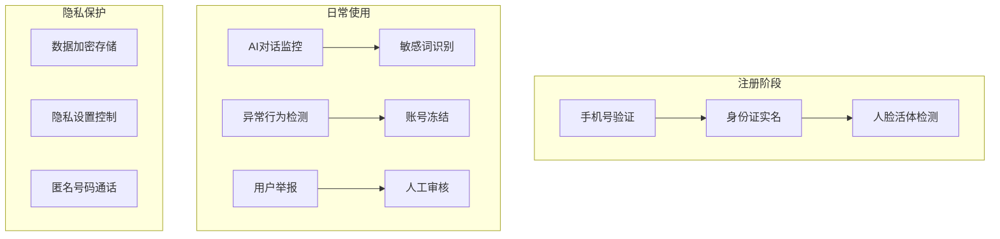
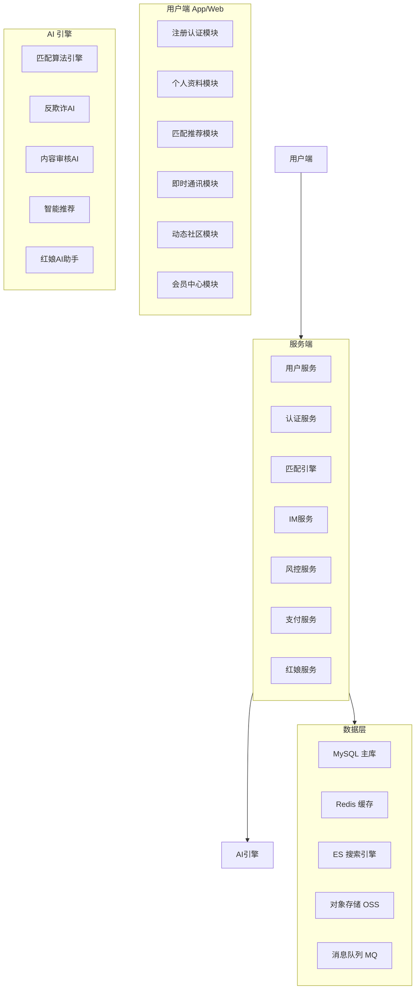

# 严肃婚恋软件 —— 竞品调研与产品方案

> 文档版本：v1.0  
> 编制日期：2026-05-26  
> 状态：待审阅

---

## 一、市场背景

中国婚恋市场规模持续增长，2025年已达 **千亿级别**。然而现有婚恋产品普遍存在 **信任危机、匹配效率低、用户体验差** 三大核心痛点。随着 90 后、00 后进入婚恋年龄，对 **真实、高效、有品质** 的严肃婚恋服务需求日益迫切。

---

## 二、竞品深度调研

### 2.1 国内竞品矩阵

| 产品 | 定位 | 认证体系 | 匹配方式 | 收费模式 | 核心优势 | 核心劣势 |
|------|------|----------|----------|----------|----------|----------|
| **世纪佳缘/百合网** | 综合婚恋 | 实名认证 | 搜索+推荐 | 会员+增值服务 | 品牌知名度高，用户量大 | 虚假信息泛滥，口碑差，UI陈旧 |
| **珍爱网** | 婚恋服务 | 实名+线下认证 | 红娘推荐 | 会员+线下红娘 | 有线下门店和服务 | 收费高，线上体验一般 |
| **Soul** | 灵魂社交 | 无强制认证 | 兴趣匹配+性格测试 | 会员+虚拟道具 | 年轻化，社交玩法丰富 | 偏社交非婚恋，匹配不精准 |
| **牵手** | 严肃交友 | 真人认证 | 双向选择+推荐 | 会员 | UI现代，体验好 | 用户量相对较少 |
| **青藤之恋** | 高学历婚恋 | 学历认证 | 每日推荐 | 会员 | 用户质量高，985/211圈子 | 门槛高，用户基数小 |
| **二狗** | 严肃婚恋 | 实名+工牌/学历 | 推荐+星球 | 会员 | 认证严格，社区氛围好 | 功能较单一 |
| **探探** | 陌生人社交 | 人脸认证 | 左滑右滑 | 会员+增值 | 用户量大，玩法简单 | 偏向约见，不严肃 |
| **陌陌** | 附近社交 | 弱认证 | 附近人+兴趣群组 | 会员+直播 | 用户量大，功能丰富 | 社交属性重，婚恋弱 |

### 2.2 国外竞品矩阵

| 产品 | 定位 | 匹配方式 | 收费模式 | 核心优势 | 核心劣势 |
|------|------|----------|----------|----------|----------|
| **eHarmony** | 严肃婚恋 | 心理学问卷+算法匹配 | 付费订阅 | 科学匹配，成功率宣传好 | 流程长，价格高 |
| **Hinge** | 认真交友 | Profile评论+推荐 | 付费订阅 | "为删除而设计"，深度互动 | 用户需主动性强 |
| **Bumble** | 女性友好 | 女性先发言+推荐 | 付费订阅 | 安全性高，女性主导 | 匹配后交流门槛高 |
| **Coffee Meets Bagel** | 精选匹配 | 每日限量推荐 | 付费订阅 | 不刷量，注重质量 | 匹配慢，易流失 |
| **Match.com** | 综合婚恋 | 搜索+推荐 | 付费订阅 | 用户量大，功能全面 | 竞品多，差异化弱 |

### 2.3 竞品核心洞察

| 维度 | 现状 | 机会点 |
|------|------|--------|
| **信任** | 虚假信息泛滥，杀猪盘频发 | **多重认证+AI反欺诈**，做最真实的平台 |
| **匹配** | 纯算法推荐效果差 | **性格+价值观+生活方式的深度匹配** |
| **体验** | 功能臃肿，付费墙过多 | **极简设计，核心功能免费，增值服务收费** |
| **安全** | 隐私泄露，骚扰严重 | **严控隐私+举报机制+AI内容审核** |
| **效率** | 大量匹配但不沟通 | **引导高质量对话，破冰工具** |

---

## 三、产品定位

### 3.1 定位宣言

> **"最认真的婚恋平台"**  
> 面向 25-40 岁以结婚为目的的单身人群，通过 **多重真人认证 + AI 深度匹配 + 红娘辅助** 三位一体的服务体系，打造真实、高效、有品质的严肃婚恋社区。

### 3.2 品牌核心理念

- **真实** —— 每一个用户都经过严格认证，拒绝虚假
- **认真** —— 只服务以结婚为目的的严肃用户
- **高效** —— AI+人工双重匹配，减少无效社交
- **安全** —— 全链路隐私保护和反欺诈

### 3.3 目标用户画像

| 维度 | 描述 |
|------|------|
| **年龄** | 25-40 岁 |
| **性别比例** | 男女比例尽量均衡（理想 45:55） |
| **教育背景** | 本科及以上学历 |
| **职业** | 白领、专业人士、公务员、创业者等 |
| **年收入** | 一线城市 15w+，二线城市 10w+ |
| **婚恋状态** | 单身，1年内有结婚打算 |
| **核心需求** | 找到条件匹配、三观契合的结婚对象 |
| **核心痛点** | 圈子窄、遇不到合适的人、怕遇到骗子 |

---

## 四、核心功能设计

### 4.1 产品功能全景图



### 4.2 核心模块详解

#### 模块一：多重认证体系 —— 产品的信任基石

| 认证等级 | 认证项 | 方式 | 必/可选 | 标识 |
|----------|--------|------|---------|------|
| L1 基础认证 | 手机号+身份证 | 实名认证接口 | 必选 | ✅ 已实名 |
| L2 可信认证 | 学历 | 学信网接口 | 必选 | 🎓 学历认证 |
| L3 优质认证 | 职业/收入 | 工牌/工资流水/个税 | 可选 | 💼 职业认证 |
| L4 资产认证 | 房产/车辆 | 房产证/行驶证 | 可选 | 🏠 资产认证 |

> **设计原则**：L1+L2 为必选（保证底线），L3+L4 为可选（展示实力）。认证越高的用户获得更多推荐权重和功能权限。

#### 模块二：AI 深度匹配系统

**匹配维度：**

1. **基础条件** —— 年龄、身高、学历、收入、地域等硬性条件
2. **性格特质** —— 基于 MBTI/大五人格的简化版性格测试（5分钟完成）
3. **价值观** —— 婚姻观、消费观、生育观、家庭观多维度问卷
4. **生活方式** —— 作息习惯、兴趣爱好、饮食偏好等
5. **择偶偏好** —— 用户主动设定的择偶标准

**匹配算法：**



> **差异化**：不搞无限滑动，每天精选推荐 **5-7 位**高匹配用户，倒逼用户认真对待每一次匹配。

#### 模块三：互动沟通

| 功能 | 说明 |
|------|------|
| **破冰问题** | 系统根据双方资料自动生成 5 个话题，降低开口难度 |
| **动态广场** | 类朋友圈的生活动态，展示真实生活状态 |
| **私信聊天** | 文本+图片+语音消息，已读回执 |
| **语音/视频通话** | 需双方互相关注或购买服务后开启 |
| **约会提议** | 标准化约会邀请流程，含时间地点建议，安全报备 |

#### 模块四：安全风控体系



### 4.3 MVP 版本功能清单

| 优先级 | 功能模块 | 具体功能 |
|--------|----------|----------|
| P0 | 注册认证 | 手机注册 + 身份证实名 + 人脸识别 |
| P0 | 个人资料 | 基本资料 + 照片上传 + 自我描述 |
| P0 | 匹配推荐 | AI 每日精选推荐 5-7 人 |
| P0 | 互动 | 破冰问题 + 私信聊天 |
| P0 | 安全 | 举报 + 拉黑 + AI 敏感词过滤 |
| P1 | 认证升级 | 学历认证 + 职业认证 |
| P1 | 匹配筛选 | 高级筛选（年龄、学历、收入等） |
| P1 | 动态广场 | 图文动态发布与浏览 |
| P1 | 增值 | 会员订阅基础版 |
| P2 | 视频认证 | 视频面审认证 |
| P2 | 性格测试 | 深度性格+价值观问卷 |
| P2 | 语音/视频 | 语音+视频通话 |
| P2 | 红娘服务 | AI 红娘助手 + 人工红娘 |
| P3 | 约会提议 | 标准化约会流程 |
| P3 | 线下活动 | 同城线下交友活动 |

---

## 五、产品架构设计

### 5.1 业务架构



### 5.2 技术栈建议

| 层级 | 技术选型 | 说明 |
|------|----------|------|
| **前端** | React Native / Flutter | 跨平台移动端 |
| **前端 Web** | React + TypeScript | 管理后台 |
| **后端** | Node.js / Go | 高并发微服务 |
| **数据库** | MySQL + Redis + Elasticsearch | 关系+缓存+搜索 |
| **IM** | 融云 / 腾讯云IM | 第三方集成 |
| **认证** | 阿里云人脸识别 + 学信网API | 第三方认证 |
| **AI** | 自研匹配算法 + LLM | 匹配+对话+审核 |
| **云服务** | 阿里云/腾讯云 | 基础设施 |
| **消息队列** | RabbitMQ / RocketMQ | 异步解耦 |

### 5.3 数据库核心模型（概要）

```
用户表 (users)
  - user_id, phone, nickname, avatar, gender, birthday, height, education, occupation, income, city, marriage_status, description, certification_level, status, created_at

认证表 (certifications)
  - cert_id, user_id, cert_type (id_card/education/occupation/property/etc), cert_status, cert_data, cert_time, expire_time

性格测评表 (personality_tests)
  - test_id, user_id, test_type (mbti/big5/values), answers_json, result_json, created_at

匹配记录表 (matches)
  - match_id, user_id_a, user_id_b, match_score, match_dimensions_json, status (pending/accepted/rejected), created_at

消息表 (messages)
  - message_id, from_user_id, to_user_id, content_type, content, status, created_at

动态表 (moments)
  - moment_id, user_id, content, images_json, likes_count, comments_count, created_at

会员表 (memberships)
  - membership_id, user_id, plan_type, start_time, end_time, status
```

---

## 六、商业模式

### 6.1 盈利模型

| 收入来源 | 描述 | 预期占比 |
|----------|------|----------|
| **会员订阅** | 基础会员/高级会员/尊享会员 三档 | 60% |
| **红娘服务** | AI红娘辅助 + 人工红娘一对一 | 20% |
| **虚拟礼物** | 互动礼物/匹配加速道具 | 10% |
| **线下活动** | 同城联谊/主题派对 | 5% |
| **广告推广** | 精准婚庆/摄影/旅游广告 | 5% |

### 6.2 会员体系

| 等级 | 价格（参考） | 核心权益 |
|------|-------------|----------|
| **免费用户** | ¥0 | 每日5次推荐，基础私信 |
| **基础会员** | ¥29/月 | 无限推荐，高级筛选，已读回执 |
| **高级会员** | ¥69/月 | 身份隐身，超级喜欢，谁看过我 |
| **尊享会员** | ¥199/月 | 专属红娘，优先推荐，视频认证标识 |

### 6.3 商业模式差异化

- **不以流量为核心**，而以 **匹配成功率为核心指标**
- 免费用户也能有良好的基础体验，避免"不付费无法使用"
- 红娘服务引入 **结果导向付费**（匹配成功后付费）

---

## 七、竞品差异化总结

| 维度 | 我们 vs 竞品 |
|------|-------------|
| **认证** | 比二狗更严格（L2 学历认证必选），比青藤更全面（多维度可选认证） |
| **匹配** | 比 Soul 更精准（多维度深度匹配），比 eHarmony 更轻量（5分钟测试） |
| **体验** | 比世纪佳缘更现代，每日限量推荐，不做 infinite scroll |
| **安全** | AI 反欺诈 + 全链路隐私保护，优于行业平均水平 |
| **服务** | AI 红娘 + 人工红娘，介于纯线上和线下之间 |
| **收费** | 比珍爱网更便宜，比探探更透明 |

---

## 八、产品迭代路线图

| 阶段 | 时间（估算） | 目标 | 核心功能 |
|------|-------------|------|----------|
| **V1.0 MVP** | 第1-2月 | 验证核心价值 | 认证+匹配+私信+基础安全 |
| **V1.5** | 第3-4月 | 增强信任 | 学历/职业认证+动态广场+视频认证 |
| **V2.0** | 第5-6月 | 提升匹配效率 | 性格测试+深度匹配+高级筛选 |
| **V2.5** | 第7-8月 | 商业化 | 会员体系+红娘服务+虚拟礼物 |
| **V3.0** | 第9-12月 | 生态扩展 | 线下活动+语音视频+约会提议 |

---

## 九、风险与应对

| 风险 | 影响 | 应对策略 |
|------|------|----------|
| **冷启动用户获取难** | 高 | 先在高校/大厂内测，口碑传播+地推 |
| **男女比例失衡** | 高 | 严格审核淘汰低质量男用户，女性优先策略 |
| **虚假信息/杀猪盘** | 高 | 多重认证+AI风控+快速举报响应 |
| **用户活跃度低** | 中 | 每日精选推荐+破冰引导+动态广场 |
| **监管合规风险** | 中 | 数据本地化+隐私合规+内容审核 |

---

## 十、下一步行动

1. ✅ **本方案审阅** —— 请确认产品定位和功能方向是否符合预期
2. ⏳ **品牌命名** —— 确定产品名称和品牌VI方向
3. ⏳ **UI/UX 原型设计** —— 进入交互和视觉设计阶段
4. ⏳ **技术选型确认** —— 确认技术栈和架构方案
5. ⏳ **MVP 开发启动** —— 进入开发阶段

---

> **本文档为产品方案初稿，欢迎提出修改意见和补充需求。**
