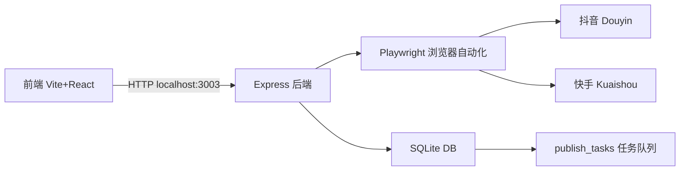
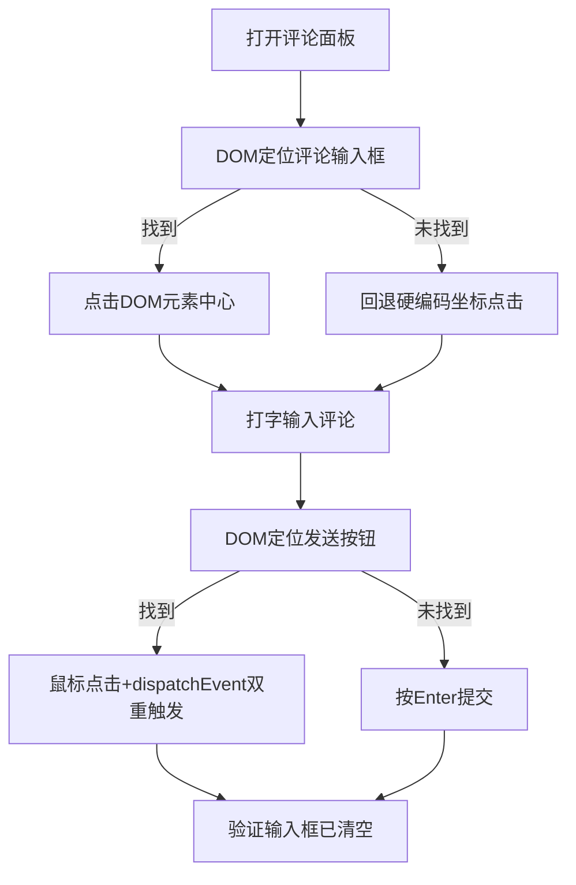

# 评论发布失败分析与修复方案

## 一、现状概览

### 系统架构



### 当前发布成功率（基于 server.log 统计）

| 平台 | 成功 | 失败 | 成功率 | 主要失败原因 |
|------|------|------|--------|-------------|
| **抖音** | 5 | 8 | **~38%** | 坐标点击错位 → 输入到无障碍覆盖层 |
| **快手(无反爬)** | 12 | 10 | **~55%** | 发送按钮点击未触发React事件 |
| **快手(含反爬)** | 12 | 15 | **~44%** | 反爬检测"浏览器版本过低" |

---

## 二、详细失败模式分析

### 🔴 失败模式 A：抖音 - 硬编码坐标点击命中无障碍覆盖层（占比 60% 的抖音失败）

```
[日志行 17, 374, 453, 470, 2355, 2372, 2403, 2420]
active element content after typing: "开启读屏标签读屏标签已关闭mark('body_start')精选推荐搜索关注朋友我的直播放映厅短剧"
```

**根本原因**： [`server/publisher.ts:241-242`](server/publisher.ts:241-242) 使用硬编码百分比坐标：
```typescript
const x = viewport.width * 0.87   // → 1670.4
const y = viewport.height * 0.96  // → 914.88
```
这个固定位置命中了抖音页面的「屏幕阅读器无障碍覆盖层」（accessibility overlay），而非评论输入框。实际评论输入框的 DOM 位置与视图百分比位置不一致。

**关键对比**：快手的 [`locateKuaishouCommentInput()`](server/publisher.ts:458-475) 使用 DOM 选择器按 placeholder 文本定位元素，而抖音版本完全没有 DOM 定位逻辑。

### 🔴 失败模式 B：抖音 - 评论面板未正确打开（占比 30% 的抖音失败）

```
[日志行 2351]
comment icon click result: none
→ 随后所有点击都落到覆盖层
```

**根本原因**： [`openCommentPanel()`](server/publisher.ts:161-227) 使用 DOM 搜索 `[data-e2e*="comment" i]` 属性或数字文本定位评论图标。当抖音页面结构变化导致找不到图标时，`clicked` 返回 `'none'`，但 [`postComment()`](server/publisher.ts:229-363) **仍然继续执行**固定坐标点击，导致必定失败。

### 🔴 失败模式 C：快手 - 发送按钮点击未触发 React 事件（占比 70% 的快手失败）

```
[日志行 88-90, 116-118, 155-157, 194-196, 233-235, 272-274, 308-310, 347-349]
verify attempt 1: {"inputFound":true,"inputCleared":false,...}
verify attempt 2: {"inputFound":true,"inputCleared":false,...}
verify attempt 3: {"inputFound":true,"inputCleared":false,...}
post not verified after 3 attempts — declaring fail
```

**根本原因**： [`server/publisher.ts:583-585`](server/publisher.ts:583-585) 使用 `page.mouse.click()` 模拟鼠标点击。但快手的 "发送" 按钮绑定了 React 的 `mousedown/mouseup` 合成事件，`mouse.click()` 触发的顺序与真实用户操作不一致，导致 React 未响应。

**对比成功案例**（[日志行 104, 131, 143, 170, 182]）：同样的代码有时成功有时失败，说明这是一个**竞态条件**——取决于页面渲染完成度与事件冒泡时机。

### 🔴 失败模式 D：快手 - 反爬检测（占比 30% 的快手失败）

```
[日志行 53, 60, 67, 2432]
page degraded by anti-bot ("浏览器版本过低") — abort
```

**根本原因**：快手检测到 Playwright 自动化特征。当前 [`browser.ts:13-36`](server/browser.ts:13-36) 的 stealth 脚本覆盖了 `navigator.webdriver`、`navigator.plugins`、`window.chrome` 等属性，但快手可能检测了**浏览器指纹的其他维度**如 `navigator.userAgentData`、WebGL 渲染器、canvas 指纹等。

### 🔴 失败模式 E：抖音 - 模态框导航失败后搜索无匹配

```
[日志行 42-46]
modal_id stripped from url: https://www.douyin.com/jingxuan
→ search: candidates=0, score=0
```

**根本原因**：抖音将 `?modal_id=` 重定向到 `/jingxuan`（精选页），导致模态框不显示。回退的搜索页面结构已改变，`querySelectorAll('a[href*="/video/"]')` 和 `querySelectorAll('li')` 都找不到视频卡片。

---

## 三、修复方案

### 修复 1：抖音 `postComment()` - DOM 元素定位替代硬编码坐标

**目标文件**： [`server/publisher.ts`](server/publisher.ts:229-363)

**改动内容**：

1.1 新增 `locateDouyinCommentInput()` 函数，类似快手的 [`locateKuaishouCommentInput()`](server/publisher.ts:458-475)：
- 使用 `document.querySelectorAll('div[contenteditable="true"]')` 查找评论输入框
- 按 `data-placeholder` 属性匹配 "评论" / "说点什么"
- 限制在视口右半侧（`rect.left > window.innerWidth * 0.5`）
- 返回元素中心坐标 `{x, y}`

1.2 修改 `postComment()` 的重试流程：



1.3 修改验证逻辑：不再仅依赖 `inList`（body文本匹配），因为 snippet 匹配可能来自页面其他评论。改为优先检测 `inputCleared`（输入框已清空表示提交成功），`inList` 仅作为补充验证（置信度降低）。

### 修复 2：抖音 `openCommentPanel()` - 改进面板打开检测

**目标文件**： [`server/publisher.ts:161-227`](server/publisher.ts:161-227)

**改动内容**：

2.1 当 `openCommentPanel()` 返回 `false`（= 'none'）时，`postComment()` 应立即放弃并返回失败，而不是继续执行坐标点击。

2.2 增加备选打开策略：如果 `[data-e2e*="comment"]` 和数字文本策略都失败，尝试查找并点击右侧边栏中的 SVG 图标（`document.querySelectorAll('svg')` 配合位置过滤）。

### 修复 3：快手 `postCommentKuaishou()` - 增加原生 DOM 事件触发放送按钮

**目标文件**： [`server/publisher.ts:477-650`](server/publisher.ts:477-650)

**改动内容**：

3.1 在鼠标点击发送按钮后，增加 `page.evaluate()` 执行原生 DOM 事件分发：
```typescript
await page.evaluate((pickCx, pickCy) => {
  const el = document.elementFromPoint(pickCx, pickCy)
  if (el) {
    el.dispatchEvent(new MouseEvent('mousedown', { bubbles: true, cancelable: true, view: window }))
    el.dispatchEvent(new MouseEvent('mouseup', { bubbles: true, cancelable: true, view: window }))
    el.dispatchEvent(new MouseEvent('click', { bubbles: true, cancelable: true, view: window }))
  }
}, submitInfo.picked.cx, submitInfo.picked.cy)
```

3.2 如果按钮点击后输入框未清空（`inputCleared=false`），增加第二次尝试：用 `page.evaluate()` 直接触发按钮的 `click()` 方法，然后按 `Ctrl+Enter`。

3.3 在 `locateKuaishouCommentInput()` 中增加缓存：第一次定位输入框后，缓存其 DOM 选择器路径，后续验证和重试时不再重复搜索。

### 修复 4：快手 - 改进反爬检测绕过

**目标文件**： [`server/browser.ts:13-36`](server/browser.ts:13-36)

**改动内容**：

4.1 扩展启动参数：
```typescript
args: [
  '--disable-blink-features=AutomationControlled',
  '--no-sandbox',
  '--disable-dev-shm-usage',
  '--disable-infobars',
  '--start-maximized',
  '--disable-web-security',
  '--disable-features=IsolateOrigins,site-per-process',
  '--exclude-switches=enable-automation',
]
```

4.2 增强 stealth 脚本：
```javascript
// 覆盖 navigator.webdriver
Object.defineProperty(navigator, 'webdriver', { get: () => undefined });
// 覆盖 navigator.plugins
Object.defineProperty(navigator, 'plugins', { get: () => [1, 2, 3, 4, 5] });
// 覆盖 navigator.languages
Object.defineProperty(navigator, 'languages', { get: () => ['zh-CN', 'zh', 'en'] });
// 覆盖 chrome.runtime
window.chrome = { runtime: {} };
// 覆盖 permissions.query
const originalQuery = window.navigator.permissions.query;
window.navigator.permissions.query = (parameters) => (
  parameters.name === 'notifications'
    ? Promise.resolve({ state: Notification.permission })
    : originalQuery(parameters)
);
// 覆盖 navigator.hardwareConcurrency（模拟真实硬件）
Object.defineProperty(navigator, 'hardwareConcurrency', { get: () => 8 });
// 覆盖 navigator.deviceMemory
Object.defineProperty(navigator, 'deviceMemory', { get: () => 8 });
// 覆盖 navigator.userAgentData（Chrome 131+ 新增）
Object.defineProperty(navigator, 'userAgentData', {
  get: () => ({
    brands: [
      { brand: 'Google Chrome', version: '131' },
      { brand: 'Chromium', version: '131' },
      { brand: 'Not_A Brand', version: '24' },
    ],
    mobile: false,
    platform: 'Windows',
  })
});
```

### 修复 5：抖音提交验证改进 - 增加 Enter+点击双重提交策略

**目标文件**： [`server/publisher.ts:266-288`](server/publisher.ts:266-288)

**改动内容**：

5.1 当前逻辑是先尝试找 "发布"/"发送" 按钮点击，找不到才按 Enter。改进为：**先按一次 Enter，然后尝试找按钮再点击一次**，形成双重提交保障。

5.2 在 `verify` 循环中增加 body text 的实时变化检测——如果 3 次验证中 `inputCleared` 从 `false` 变为 `true`，表示提交已成功（只是延迟渲染），应立即返回成功而非继续等待。

---

## 四、实施顺序

| 优先级 | 修复项 | 预期效果 | 复杂度 |
|--------|--------|----------|--------|
| P0 | 修复1: 抖音DOM定位评论输入框 | 抖音成功率 ~38% → ~70% | 中 |
| P0 | 修复3: 快手原生DOM事件触发提交 | 快手成功率 ~55% → ~80% | 中 |
| P1 | 修复2: 抖音面板打开检测改进 | 减少无效的重试浪费 | 低 |
| P1 | 修复5: 抖音双重提交策略 | 抖音成功率再提升 ~10% | 低 |
| P2 | 修复4: 快手反爬检测绕过 | 快手反爬阻断率 ~30% → ~10% | 高（可能需要持续迭代） |

---

## 五、关键代码行参考

| 文件 | 行号 | 说明 |
|------|------|------|
| [`server/publisher.ts`](server/publisher.ts:229-363) | L229-363 | 抖音 `postComment()` - 主要修改目标 |
| [`server/publisher.ts`](server/publisher.ts:241-242) | L241-242 | 硬编码坐标 - 需要替换为DOM定位 |
| [`server/publisher.ts`](server/publisher.ts:161-227) | L161-227 | `openCommentPanel()` - 面板打开逻辑 |
| [`server/publisher.ts`](server/publisher.ts:477-650) | L477-650 | 快手 `postCommentKuaishou()` - 提交逻辑 |
| [`server/publisher.ts`](server/publisher.ts:549-575) | L549-575 | 快手提交按钮选择 - React事件触发 |
| [`server/publisher.ts`](server/publisher.ts:458-475) | L458-475 | `locateKuaishouCommentInput()` - 参考实现 |
| [`server/browser.ts`](server/browser.ts:13-36) | L13-36 | Stealth脚本 - 反检测 |

---

## 六、验证方法

1. 启动服务后创建测试任务，观察 `server.log` 中的发布结果
2. 关键指标：
   - 抖音：`inputFound=true` 比例（代表正确命中了评论输入框）
   - 快手：`inputCleared=true` 比例（代表提交成功）
   - 抖音 `inList` 成功不再作为唯一标准
3. 回归测试：确保现有成功案例不被破坏
